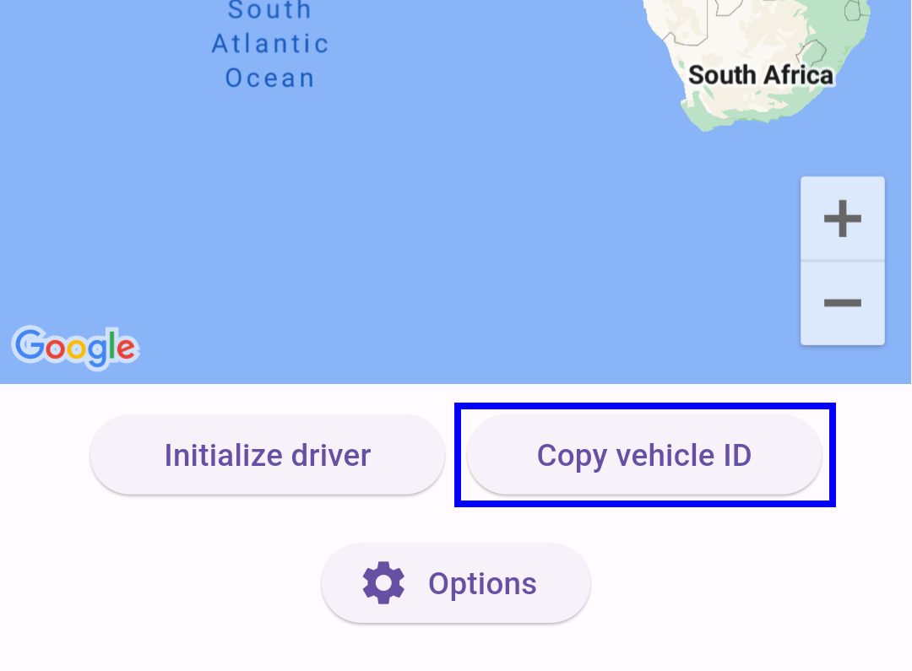

# google_driver_flutter_example

Demonstrates how to use the google_driver_flutter plugin.

## Starting example app backend services

Driver SDK example app requires a backend services to be running. The backend services are provided as Docker containers. To start the backend services, read the [documentation](./tools/backend/README.md) in the tools/backend folder of the example app.

## Setting up API Keys

To run the example project, you need to provide your Google Maps API key for both Android and iOS platforms.
Both Android and iOS builds are able to use the `MAPS_API_KEY` variable provided through Dart defines.
However, this can be overridden to use separate, platform-specific API keys if needed.

### Using Dart defines

Using Dart defines to provide the Google Maps API key is the preferred method for this example app. It allows the key to be utilized in Dart code for accessing Google Maps services, such as the Routes API. Additionally, Patrol integration tests should also be run with the API key provided via Dart defines.

Run the app with the API key as a Dart define.
```bash
flutter run --dart-define MAPS_API_KEY=YOUR_API_KEY --dart-define PROJECT_ID=YOUR_PROJECT_ID
```

The example app demonstrates multiple ways to provide the Maps API key for platforms.

### Android specific API key

For Android, the example app determines the `MAPS_API_KEY` using the following order (first match applies):
1. `MAPS_API_KEY` variable in `local.properties` file
2. `MAPS_API_KEY` variable in environment variables
3. `MAPS_API_KEY` variable in Dart defines

#### Setting the API Key in local.properties
The project uses the [Google Maps Secrets Gradle Plugin](https://developers.google.com/maps/documentation/android-sdk/secrets-gradle-plugin) for secure API key management. Place your Google Maps API key in `example/android/local.properties` file in the following format:

```text
MAPS_API_KEY=YOUR_API_KEY_HERE
```

This key will be specifically used for the Android build, overriding the Dart define value.

> [!NOTE]
> `local.properties` file should always be listed in your .gitignore file to ensure it is not committed to your repository.

### iOS specific API key

For iOS, the app attempts to read the `MAPS_API_KEY` in this order (first match applies):

1. `MAPS_API_KEY` variable in Xcode environment variables
2. `MAPS_API_KEY` variable in Dart defines
3. Default API key from `AppDelegate.swift`.

#### Set the API key

**1. Option: Xcode Environment Variables**

Add an environment variable named `MAPS_API_KEY` in the Xcode scheme settings.

**2. Option: Directly in AppDelegate.swift**

Set the API key directly in `example/ios/Runner/AppDelegate.swift`:

```swift
...
override func application(
    _ application: UIApplication,
    didFinishLaunchingWithOptions launchOptions: [UIApplication.LaunchOptionsKey: Any]?
) -> Bool { 
    GMSServices.provideAPIKey("YOUR_API_KEY") // REPLACE THIS TEXT WITH YOUR API KEY
    GMSServices.setMetalRendererEnabled(true)
    GeneratedPluginRegistrant.register(with: self)
    return super.application(application, didFinishLaunchingWithOptions: launchOptions)
}
...
```

> [!NOTE]
> Be cautious with API keys. Avoid exposing them in public repositories, especially when hardcoded in the project files or the environment variables.

## Running the example app

To run the example app, follow these steps:
1. Start sample backends as described in the [Starting example app backend services](#starting-example-app-backend-services) section.
2. Start the emulator or connect your device.
3. Run the following command from the root of the example project: 
    ``` bash
    cd example
    flutter run --dart-define MAPS_API_KEY=YOUR_API_KEY --dart-define PROJECT_ID=YOUR_PROJECT_ID
    ```
If you want to run the example app with a specific API key, see the [Setting up API Keys](#setting-up-api-keys) section.

> [!TIP](Pod-related issues on iOS)
> If you encounter pod-related issues when running the example code on iOS, you can try running the following commands from the `example/ios` folder:
>  - pod repo update
>  - pod install
> 
> These commands will update and install the required pod files specifically for iOS.

### Dart defines

Supported dart define values and their default values:
| Dart define | Description | Default value |
| ----------- | ----------- | ------------- |
| `MAPS_API_KEY` | Google Maps API key | `null` |
| `PROJECT_ID` | Firebase project ID | `null` |
| `LMFS_ANDROID_HOST_URL` | Android sample backend services base URL for Delivery Driver (LMFS) | [http://10.0.2.2:8091](#) |
| `LMFS_IOS_HOST_URL` | iOS backend sample services base URL for Delivery Driver (LMFS) | [http://localhost:8091](#) |
| `ODRD_ANDROID_HOST_URL` | Android backend sample services base URL for Ridesharing Driver (ODRD) | [http://10.0.2.2:8092](#) |
| `ODRD_IOS_HOST_URL` | iOS backend sample services base URL for Ridesharing Driver (ODRD) | [http://localhost:8092](#) |

### Running the example app on physical devices

When running the example app on physical devices, you need to replace the `localhost` and `10.0.2.2` with the IP address of the machine running the backend services.

Build the flutter example app with following command:
```bash
cd example
flutter run \
    --dart-define LMFS_ANDROID_HOST_URL=http://YOUR_MACHINE_IP:8091 \
    --dart-define LMFS_IOS_HOST_URL=http://YOUR_MACHINE_IP:8091 \
    --dart-define ODRD_ANDROID_HOST_URL=http://YOUR_MACHINE_IP:8092 \
    --dart-define ODRD_IOS_HOST_URL=http://YOUR_MACHINE_IP:8092 \
    --dart-define ...
```

### Follow delivery vehicle updates using Fleet Tracking web console

1. Start sample backends as described in the [Starting example app backend services](#starting-example-app-backend-services) section.
2. Start the example app as described in the [Running the example app](#running-the-example-app) section.
3. Open Delivery Driver (LMFS) example page and copy the `vehicle ID`.
   
   
4. Open the LMFS backend Fleet Tracking web console at [http://localhost:8091/fleet_tracking.html](http://localhost:8091/fleet_tracking.html).
5. Paste the `vehicle ID` into the `Delivery Vehicle ID` input in Fleet Tracking web console.
6. Start navigation on example page.
7. Observe the vehicle updates on the Fleet Tracking web console.